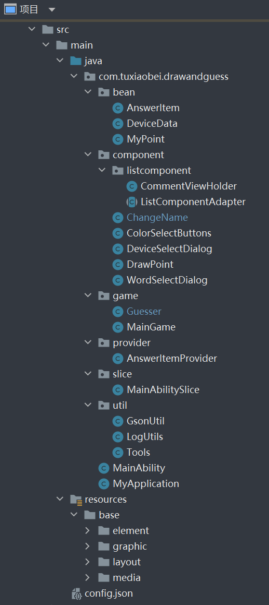

# Draw and guess 你画我猜


基于 HarmonyOS 分布式能力的你画我猜小游戏

由鸿蒙官方 Codelabs 中的[分布式手写板项目](https://developer.huawei.com/consumer/cn/codelabsPortal/carddetails/Distribute-Database-Draw)二次开发。

四川大学网络空间安全学院 2021-2022学年度春（大一下）面向对象程序设计导论（Java）期末项目

by tuxiaobei

## 效果演示

**注：以下演示画面均使用华为提供的鸿蒙远程模拟器，因为是远程操作上会存在较大延时**

由于没有多个本地设备（没钱），远程模拟器只支持两个设备协同，所以不保证在实机或三个及以上设备的体验。

### 选择共享设备并拉起

选择附近同一个账号的鸿蒙设备，并拉起页面（理论上可以与无限个设备共享，但是远程模拟器只提供了两个设备）

![[optimize output image]](README.assets/ezgif-2-fa1869f96d.gif)

### 选择词语开始游戏并绘画

选择词语：系统将从词库中随机选择三个词语共绘画者选择，为避免刷词语的情况出现，只有当选择词语开始游戏后词语才会重新随机生成新的词语。

生成的词语保证三个词语两两不同，且上一轮出现过的词语不会再次出现。

开始游戏后，画板与答案消息均会被清空。

可以选择多种颜色的画笔，画板所有设备实时同步，支持撤销。

![[video-to-gif output image]](README.assets/ezgif-2-eaffc8a000.gif)


### 回答与答案判定

消息提示区将会所有设备实时同步。

若回答正确将会将答案正确的消息（不含实际答案）插入消息区。

若回答离正确答案相似（相似的定义为编辑距离等于 $1$ 或小于正确答案长度的 $25\%$），将会将答案相似的消息（不含实际答案）插入到消息区，且只有绘画者和自己看见实际提交的答案。

>编辑距离：两个字串之间，由一个转换成另一个所需的最少编辑操作次数，允许的编辑操作包括：
>
>- 将其中一个字符替换成另一个字符（`Substitutions`）。
>- 插入一个字符（`Insertions`）。
>- 删除一个字符（`Deletions`）。

答案错误将会将错误答案插入到消息区，所有人都可以看见错误的词语，以排除错误的答案。

消息气泡用不同的颜色加以区分，更加醒目。

答对后提交框自动关闭禁止再次提交，可统计自己累计答对了多少道题目，新一局游戏开始则会再次允许提交。

![[optimize output image]](README.assets/ezgif-2-95706ca19d.gif)

### 更改昵称

猜测者默认生成一个长度为 6 的ID。

可以自定义自己的名称，自定义的名称实时同步。

![[optimize output image]](README.assets/ezgif-2-8124560c97.gif)

## 编译此项目

1. 安装 [DevEco Studio](https://developer.harmonyos.com/cn/develop/deveco-studio/) （DevEco Studio 3.0 Beta2 for HarmonyOS）
2. 设置DevEco Studio开发环境。DevEco Studio开发环境需要连接到网络，以确保该正常使用。
3. 下载此项目
4. 打开HUAWEI DevEco Studio，单击File> Open选择此项目
5. 单击Build> Build App(s)/Hap(s)>Build Debug Hap(s)以编译hap软件包
6. 运行远程模拟器（选择Super Device 的 P40+P40）
7. Super App Run

注意

- 您可以选择在模拟器或真机上运行hap软件包。
- 如果在真机上运行它，则需要在项目的File> Project Structure> Modules> Signing Configs中配置签名和证书信息。

## 项目结构解读



- `bean`：`DeviceData` 设备适配器实体类；`MyPoint` 存放绘制点的坐标和基本信息；`AnswerItem` 存放答案消息元素。
- `listcomponent`：根据每个设备处理每个设备组件。
- `component`：`DeviceSelectDialog` 展示设备列表对话框，用户选择设备（可以是多个设备）进行连接；`DrawPoint` 存放所有绘制点的基本信息和绘图；`ChangeName` 展示更改昵称对话框；`ColorSelectButtons` 控制颜色的选择；`WordSelectDialog` 展示词语选择对话框。
- `game`：游戏控制，`MainGame` 为绘画者，`Guesser` 为猜测者
- `provider`：`AnswerItemProvider` 答案消息的展示
- `slice`：`MainAbilitySlice` 画板的主界面。
- `utils`：`LogUtils` 主要作用打印日志信息；`GsonUtil` 用于将列表转成字符串；`Tools` 包含一些工具函数。
- `resources`：存放工程使用到的资源文件，其中 `resources\base\layout`下存放xml布局文件，`resources\base\media` 下存放图片资源。`resources\base\element\words.json` 为词库
- `config.json`：应用的配置文件。

## 知识点

### Java UI框架

应用将在屏幕上显示一个用户界面，该界面用来显示所有可被用户查看和交互的内容。

应用中所有的用户界面元素都是由Component和ComponentContainer对象构成。Component是绘制在屏幕上的一个对象，用户能与之交互。ComponentContainer是一个用于容纳其他Component和ComponentContainer对象的容器。

Java UI框架提供了一部分Component和ComponentContainer的具体子类，即创建用户界面（UI）的各类组件，包括一些常用的组件（比如：文本、按钮、图片、列表等）和常用的布局（比如：DirectionalLayout和DependentLayout）。用户可通过组件进行交互操作，并获得响应。

所有的UI操作都应该在主线程进行设置。

### 分布式数据服务

分布式数据服务（Distributed Data Service，DDS） 为应用程序提供不同设备间数据库数据分布式的能力。

通过调用分布式数据接口，应用程序将数据保存到分布式数据库中。通过结合帐号、应用和数据库三元组，分布式数据服务对属于不同应用的数据进行隔离，保证不同应用之间的数据不能通过分布式数据服务互相访问。

在通过可信认证的设备间，分布式数据服务支持应用数据相互同步，为用户提供在多种终端设备上最终一致的数据访问体验。

**即多个设备共用数据库，可实现便捷的跨设备间的数据同步**

本项目共使用三个分布式数据库：

`pointsSingleKvStore` ：存储画笔点数据（位置、颜色等）

`ansSingleKvStore`：存储答案消息

`nameSingleKvStore`：昵称数据库

### 多设备协同权限

需要申请多设备协同相关权限

| 权限名                                          | 说明                                                 |
| ----------------------------------------------- | ---------------------------------------------------- |
| ohos.permission.DISTRIBUTED_DATASYNC            | 必选（分布式数据管理权限，允许不同设备间的数据交换） |
| ohos.permission.DISTRIBUTED_DEVICE_STATE_CHANGE | 必选（允许获取分布式组网内设备的状态变化）           |
| ohos.permission.GET_DISTRIBUTED_DEVICE_INFO     | 必选（允许获取分布式组网内的设备列表和设备信息）     |
| ohos.permission.GET_BUNDLE_INFO                 | 必选（查询其他应用信息的权限）                       |

在 `config.json` 中设置权限

```json
"reqPermissions": [
    {
        "reason": "多设备协同",
        "name": "ohos.permission.DISTRIBUTED_DATASYNC",
        "usedScene": {
            "ability": [
                "MainAbility"
            ],
            "when": "always"
        }
    },
    {
        "name": "ohos.permission.DISTRIBUTED_DATASYNC "
    },
    {
        "name": "ohos.permission.DISTRIBUTED_DEVICE_STATE_CHANGE"
    },
    {
        "name": "ohos.permission.GET_DISTRIBUTED_DEVICE_INFO"
    },
    {
        "name": "ohos.permission.GET_BUNDLE_INFO"
    }
],
```

## 部分代码展示

### `MainAbilitySlice` 

```java
/**
* 设置昵称
* @param name 昵称
*/
private void setName(String name) {
    title.setText(name);
    local_name = name;
    nameSingleKvStore.putString(Tools.getDeviceId(this), name);
}

/**
* 添加答案元素
* @param ans
*/
public void addAnswer(AnswerItem ans) {
    ans.setDeviceId(Tools.getDeviceId(this));
    ansData.add(0, ans);
    String ansString = GsonUtil.objectToString(ansData);
    if (ansSingleKvStore != null) {
        ansSingleKvStore.putString(ANS_KEY, ansString);
    }
}

/**
* 开始新游戏
* @param word 新词语
*/
private void newGame(String word) {
    ansData.clear();
    AnswerItem a = new AnswerItem("开始第 " + main_game.getRoundnum() +" 轮游戏了！", 4);
    a.setWord(word);
    addAnswer(a);
    //answerItemProvider.notifyDataChanged();
    main_game.setWord(word);
    main_game.generateWords();
    title.setText(word);
    clearBoard();
}

/**
* 展示答案消息列表
* @param answers 答案消息数据
*/
private void showAns(List<AnswerItem> answers) {
    if (!isLocal) {
        guesser.checkEnable(answers);
    }
    ansData.clear();
    ansData.addAll(answers);
    answerItemProvider.notifyDataChanged();
}

/**
* 清空画板
*/
private void clearBoard() {
    List<MyPoint> points = new ArrayList<>(0);
    drawl.setDrawParams(points);
    String pointsString = GsonUtil.objectToString(points);
    if (pointsSingleKvStore != null) {
        pointsSingleKvStore.putString(POINTS_KEY, pointsString);
    }
}

/**
* 获取数据库中的点数据，并在画布上画出来
*/
private void drawPoints() {
    List<Entry> points = pointsSingleKvStore.getEntries(POINTS_KEY);
    for (Entry entry : points) {
        if (entry.getKey().equals(POINTS_KEY)) {
            List<MyPoint> remotePoints = GsonUtil.jsonToList(pointsSingleKvStore.getString(POINTS_KEY), MyPoint.class);
            getUITaskDispatcher().delayDispatch(() -> drawl.setDrawParams(remotePoints), DELAY_TIME);
        }
    }
}

/**
* 更新答案消息列表
*/
private void updateAnsShow() {
    List<Entry> ans = ansSingleKvStore.getEntries(ANS_KEY);
    for (Entry entry : ans) {
        if (entry.getKey().equals(ANS_KEY)) {
            List<AnswerItem> remoteAns= GsonUtil.jsonToList(ansSingleKvStore.getString(ANS_KEY), AnswerItem.class);
            getUITaskDispatcher().delayDispatch(() -> {showAns(remoteAns);}, DELAY_TIME);
        }
    }
}

/**
* 获取昵称
* @param deviceId 设备id
* @return 昵称
*/
public String getName(String deviceId) {
    if (Tools.getDeviceId(this).equals(deviceId)) {
        if (isLocal) {
            return "系统";
        }
        return local_name;
    }
    String ret;
    try {
        ret = nameSingleKvStore.getString(deviceId);
    }catch (KvStoreException e) {
        ret = deviceId.substring(0, 6);
    }
    if (ret == null || ret.isEmpty()) {
        ret = deviceId.substring(0, 6);
    }
    return ret;
}
/**
* Receive database messages
* 接收数据库更改消息
*/
private class pointsKvStoreObserverClient implements KvStoreObserver {
    @Override
    public void onChange(ChangeNotification notification) {
        LogUtils.info(TAG, "data changed......");
        drawPoints();
    }
}

private class ansKvStoreObserverClient implements KvStoreObserver {
    @Override
    public void onChange(ChangeNotification notification) {
        LogUtils.info(TAG, "ans changed......");
        updateAnsShow();
    }
}

private class nameKvStoreObserverClient implements KvStoreObserver {
    @Override
    public void onChange(ChangeNotification notification) {
        LogUtils.info(TAG, "name changed......");
        getUITaskDispatcher().delayDispatch(() -> {answerItemProvider.notifyDataChanged();}, DELAY_TIME);
    }
}

/**
* 创建分布式数据库
*/
private void initDatabase() {
    // 创建分布式数据库管理对象
    KvManagerConfig config = new KvManagerConfig(this);
    kvManager = KvManagerFactory.getInstance().createKvManager(config);
    // 创建分布式数据库
    Options options = new Options();
    options.setCreateIfMissing(true).setEncrypt(false).setKvStoreType(KvStoreType.SINGLE_VERSION);
    pointsSingleKvStore = kvManager.getKvStore(options, storeId);
    // 订阅分布式数据变化
    KvStoreObserver kvStoreObserverClient = new pointsKvStoreObserverClient();
    pointsSingleKvStore.subscribe(SubscribeType.SUBSCRIBE_TYPE_ALL, kvStoreObserverClient);

    // 创建分布式数据库
    ansSingleKvStore = kvManager.getKvStore(options, storeId);
    // 订阅分布式数据变化
    KvStoreObserver kvStoreObserverClient1 = new ansKvStoreObserverClient();
    ansSingleKvStore.subscribe(SubscribeType.SUBSCRIBE_TYPE_ALL, kvStoreObserverClient1);

    // 创建分布式数据库
    nameSingleKvStore = kvManager.getKvStore(options, storeId);
    // 订阅分布式数据变化
    KvStoreObserver kvStoreObserverClient2 = new nameKvStoreObserverClient();
    nameSingleKvStore.subscribe(SubscribeType.SUBSCRIBE_TYPE_ALL, kvStoreObserverClient2);

}
```

### `AnswerItemProvider`

```java
public Component getComponent(int position, Component convertComponent, ComponentContainer componentContainer) {
    final Component cpt;
    cpt = LayoutScatter.getInstance(slice).parse(ResourceTable.Layout_item_answer, null, false);
    AnswerItem sampleItem = list.get(position);
    Text text = (Text) cpt.findComponentById(ResourceTable.Id_item_info);
    String ret = null;
    boolean myans = sampleItem.getDeviceId().equals(Tools.getDeviceId(slice));
    switch (sampleItem.getStatus()) {
        case 1: //错误答案
            ret = sampleItem.getAns();
            text = (Text) cpt.findComponentById(ResourceTable.Id_item_wa);
            break;
        case 4: //系统消息
            ret = sampleItem.getAns();
            break;
        case 2: //相似答案
            if (myans) {
                ret = "你的答案很接近了：" + sampleItem.getAns();
            } else if (isLocal){
                ret = "答案很接近了：" + sampleItem.getAns();
            } else {
                ret = "答案很接近了";
            }
            text = (Text) cpt.findComponentById(ResourceTable.Id_item_sim);
            break;
        case 3: //正确答案
            if (myans) {
                ret = "恭喜你回答正确！";
            } else {
                ret = "回答正确！";
            }
            text = (Text) cpt.findComponentById(ResourceTable.Id_item_ok);
            break;
    }
    if (ret != null) {
        text.setText(slice.getName(sampleItem.getDeviceId()) + ":" + ret);
        text.setVisibility(Component.VISIBLE);
        return cpt;
    } else {
        return null;
    }

}
```

### `Guesser`

```java
public class Guesser extends Ability{
    private Button submit;
    private TextField ans;
    private Text tip;
    private MainAbilitySlice main;
    private String nowroundid = null;
    private Boolean enable;
    private String word;
    private Text show_score;
    private int score;
    public Guesser(Button submit, TextField ans, Text tip, Text show_score, MainAbilitySlice main) {
        this.submit = submit;
        this.ans = ans;
        this.main = main;
        this.tip = tip;
        this.score = 0;
        this.show_score = show_score;
        submit.setClickedListener(component -> { //监听提交答案
            String answer = ans.getText();
            ans.setText("");
            if (!answer.isEmpty() && enable) {
                AnswerItem a = new AnswerItem(answer, 0);
                checkAnswer(a);
                ans.clearFocus();
                if (a.getStatus() == 3) {
                    ans.setVisibility(Component.HIDE);
                    submit.setVisibility(Component.HIDE);
                    ans.setTextCursorVisible(false);
                    ans.setEnabled(false);
                    tip.setText("恭喜你答对了！");
                    tip.setTextColor(new Color(Color.getIntColor("#2ecc71")));
                    tip.setVisibility(Component.VISIBLE);
                    score += 1;
                    show_score.setText("得分:"+score);
                    enable = false;
                }
                main.addAnswer(a);
            }

        });
        tip.setVisibility(Component.VISIBLE);

        enable = false;
    }

    /**
     * 判断新一局游戏是否开始
     * @param answers 答案消息数据
     */
    public void checkEnable(List<AnswerItem> answers) {
        for (AnswerItem answer : answers) {
            if (answer.getStatus() == 4 && !answer.getRid().equals(nowroundid)) {
                ans.setVisibility(Component.VISIBLE);
                submit.setVisibility(Component.VISIBLE);
                tip.setVisibility(Component.HIDE);
                ans.setEnabled(true);
                ans.setTextCursorVisible(true);
                enable = true;
                nowroundid = answer.getRid();
                word = answer.getWord();
            }
        }
    }

    /**
     * 动态规划计算编辑距离
     * @param a 字符串A
     * @param b 字符串B
     * @return 编辑距离
     */
    private int getLevenshteinDistance(String a, String b) {
        int la = a.length(), lb = b.length();
        int[][] f = new int[la + 1][lb + 1];
        for (int i = 1; i <= la; i++)
            f[i][0] = i;
        for (int i = 1; i <= lb; i++)
            f[0][i] = i;
        f[0][0] = 0;
        for (int i = 1; i <= la; i++) {
            for (int j = 1; j <= lb; j++) {
                if (a.charAt(i - 1) == b.charAt(j - 1))
                    f[i][j] = f[i - 1][j - 1];
                else
                    f[i][j] = Math.min(f[i - 1][j], Math.min(f[i][j - 1], f[i - 1][j - 1])) + 1;
            }
        }
        return f[la][lb];

    }

    /**
     * 答案判定
     * @param answer 答案
     */
    public void checkAnswer(AnswerItem answer) {
        if (answer.getStatus() > 0) {
            return;
        }
        if (answer.getAns().equals(word)) {
            answer.setStatus(3);
            return;
        }
        int k = getLevenshteinDistance(word, answer.getAns());
        if (k == 1 || (k / word.length() < 0.25)) {
            answer.setStatus(2);
        } else {
            answer.setStatus(1);
        }
    }
}
```

### 词库

```json
{
  "strarray": [
    {
      "name": "words",
      "value": [
        {
          "value": "西瓜"
        },
        {
          "value": "蓝莓"
        },
        {
          "value": "西红柿"
        },
        {
          "value": "香蕉"
        },
        {
          "value": "苹果"
        },
        {
          "value": "猕猴桃"
        },
        {
          "value": "樱桃"
        },
        {
          "value": "柠檬"
        },
        {
          "value": "火龙果"
        },
        {
          "value": "木瓜"
        }
      ]
    }
  ]
}
```


